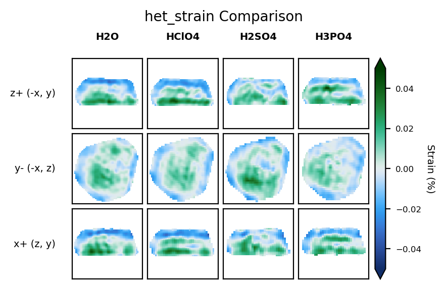
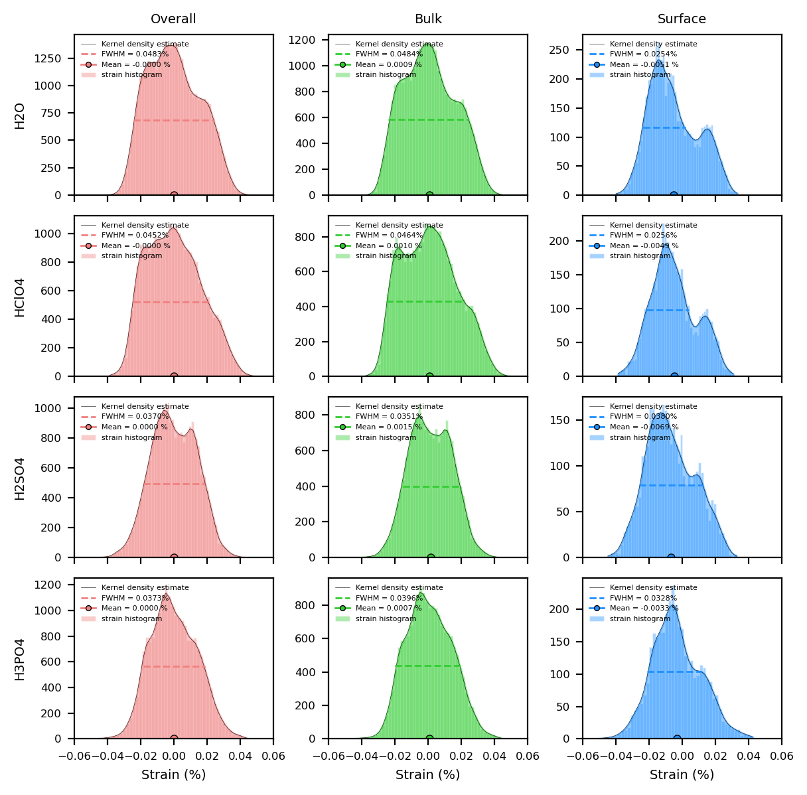

BCDI Reconstruction Analysis Tutorial
=====================================

This tutorial provides a step-by-step workflow for analysing and comparing Bragg Coherent Diffraction Imaging (BCDI) reconstructions stored in CXI files. You'll learn how to:

1. Explore CXI file structure with ``CXIExplorer``
2. Load specific datasets from reconstructions
3. Visualise and compare different conditions and quantities
4. Generate customised plots for analysis

Of course, this is just a starting point. You can adapt the code to suit your specific needs and datasets. Copy the code snippets into your own Jupyter notebook and modify them as needed.

1. Setup and Initialisation
---------------------------

Initial Setup
^^^^^^^^^^^^^

Start by importing the necessary libraries and setting up plotting parameters:

.. code-block:: python

    # import required packages
    from IPython.display import display
    import matplotlib.pyplot as plt
    from matplotlib.colors import LogNorm
    import numpy as np

    import cdiutils

    # set default plotting parameters
    cdiutils.plot.update_plot_params()

1.1 Set Paths to Your Data
^^^^^^^^^^^^^^^^^^^^^^^^^^

First, specify the directory where your reconstruction results are stored:

.. code-block:: python

    results_dir = (
        "path/to/the/results/directory"  # replace with the actual path to your results directory
    )

1.2 Explore CXI File Structure
^^^^^^^^^^^^^^^^^^^^^^^^^^^^^^

The ``CXIExplorer`` lets you interactively explore the structure of your CXI files before loading specific data. This helps you identify available datasets and their paths. Here, we only use the ``CXIExplorer.explore()`` method, but you can find more about how to explore CXI file in the ``explore_cxi_file.ipynb`` notebook.

Select one of your CXI files to explore:

.. code-block:: python

    # path to one of your CXI files for exploration
    cxi_path = results_dir + "Sample_Name/S000/S000_postprocessed_data.cxi"
    
    cxi_path = "/scisoft/clatlan/dev/tutorials/examples_and_tutorials/analysis/results/B18S2P1_Ni/S706/S706_postprocessed_data.cxi"
    
    # initialise a new explorer instance
    explorer = cdiutils.io.CXIExplorer(cxi_path)
    
    # launch the interactive browser
    explorer.explore()

.. code-block:: python

    # make sure to close the explorer when done
    explorer.close()

1.3 Define Samples and Conditions
^^^^^^^^^^^^^^^^^^^^^^^^^^^^^^^^^

Create a table matching experimental conditions to sample names and scan numbers. This will help organise your data for comparison:

.. code-block:: python

    # create a table of conditions and corresponding samples
    # format: (condition_name, sample_name, scan_number)
    table = [
        # example entries - replace with your actual data
        ("Condition_A", "Sample_Name_A", 3),
        ("Condition_B", "Sample_Name_B", 6),
        ("Condition_C", "Sample_Name_C", 6),
        ("Condition_D", "Sample_Name_D", 3),
        # add more conditions as needed
    ]

1.4 Load Data from CXI Files
^^^^^^^^^^^^^^^^^^^^^^^^^^^^

Now we'll load specific datasets from each sample's CXI file. Based on the file exploration above, you can identify which quantities to load.

``cdiutils`` provides a convenient function to load data from CXI files. You can use the ``cdiutils.io.load_cxi`` function to conveniently load data from CXI files. The ``cdiutils`` library provides a convenient function to load data from CXI files. It requires the path to the CXI file and a dataset name to load. If the dataset name is not the exact full "key path", say ``"voxel_size"`` instead of ``"entry_1/result_1/voxel_size"``, the function will find it for you anyway. Note that you can provide as much as keys as you want, and the function will return a dictionary with the keys as the dataset names and the values as the data loaded from the CXI file:

Load specific datasets from each sample's CXI file. Based on the file exploration above, you can identify which quantities to load:

.. code-block:: python

    # list of quantities to extract from CXI files
    quantities = (
        "support", "het_strain", "het_strain_from_dspacing", "dspacing",
        "amplitude", "displacement", "phase", "lattice_parameter"
        # add or remove quantities based on your needs
    )
    
    # initialise the voxel_sizes dictionary
    voxel_sizes = {condition: None for condition, _, _ in table}
    # path to the results directory
    
    # initialise a dictionary to store the structural properties
    structural_properties = {
        condition: {} for condition, _, _ in table
    }
    
    # path template for post-processed data
    path_template = results_dir + "{}/S{}/S{}_postprocessed_data.cxi"
    
    # load data for each condition
    for condition, sample_name, scan in table:
        path = path_template.format(sample_name, scan, scan)
        
        # load all specified quantities from the CXI file
        structural_properties[condition] = cdiutils.io.load_cxi(path, *quantities)
        voxel_sizes[condition] =  cdiutils.io.load_cxi(path, "voxel_size")
    
    # apply support mask: set values outside the support to NaN
    for key in quantities:
        if key != "support" and key != "amplitude":  # keep amplitude outside support
            for condition, _, _ in table:
                structural_properties[condition][key] *= cdiutils.utils.zero_to_nan(
                    structural_properties[condition]["support"]
                )

2. Visualise and Compare Datasets
---------------------------------

2.1 Configure Plot Settings
^^^^^^^^^^^^^^^^^^^^^^^^^^^

Set up colour maps and value ranges for visualising different quantities. The ``cdiutils`` package provides default configurations that you can customise:

.. code-block:: python

    # get the default plot configurations from cdiutils
    _, _, plot_configs = cdiutils.plot.set_plot_configs()

To check out the predefined colour maps, you can copy/paste this code in a cell and run it:

.. code-block:: python

    print("Plot configs:")
    print("=============\n")
    for quantity, d in plot_configs.items():
        print(f'"{quantity}": ')
        for key, value in d.items():
            print(f'\t"{key}": {value}')

2.2 Visualise Individual Quantities
^^^^^^^^^^^^^^^^^^^^^^^^^^^^^^^^^^^

Let's start by plotting a single quantity (e.g., heterogeneous strain) for all conditions to compare them.

- **With ``cdiutils.plot.plot_volume_slices``**: This function allows you to plot slices of a single 3D data volume. You can specify the quantity, colourmap, and value range for visualisation.

.. note::
   If no ``convention`` is provided, we use "natural" plotting conventions, i.e.:
   
   - first slice plot: slice taken at the middle of dim0, dim1 along y-axis, dim2 along x-axis
   - second slice plot: slice taken at the middle of dim1, dim0 along y-axis, dim2 along x-axis
   - third slice plot: slice taken at the middle of dim2, dim0 along y-axis, dim1 along x-axis

.. code-block:: python

    # select the quantity to visualise
    quantity = "het_strain"  # change this to any quantity from your list
    
    # plot the selected quantity for each condition
    for (condition, _, _) in table:
        fig, axes = cdiutils.plot.plot_volume_slices(
            structural_properties[condition][quantity],
            title=condition,
            cmap=plot_configs[quantity]["cmap"],
            
            # comment this block if you don't need real size extents
            voxel_size=voxel_sizes[condition],
            data_centre=(0, 0, 0),
            show=False,
            convention="cxi",
            
            # adjust these colouring limits based on your data
            vmin=-0.05,
            vmax=0.05,
        )
        
        # comment this block if you don't need real size extents
        for ax in axes.flat:
            ax.set_xlim(-300, 300)  # nm
            ax.set_ylim(-300, 300)  # nm
        
        # comment this block if you don't need real size extents
        cdiutils.plot.add_labels(axes)
        display(fig)

2.3 Comparing Multiple Volumes Simultaneously
^^^^^^^^^^^^^^^^^^^^^^^^^^^^^^^^^^^^^^^^^^^^^

The ``plot_multiple_volume_slices`` function allows you to visualise and compare multiple 3D volumes in a single figure. It's particularly useful for comparing the same quantity across different experimental conditions or different quantities for the same sample.

Basic Usage
'''''''''''

At its simplest, you can just pass multiple datasets:

.. code-block:: python

    cdiutils.plot.plot_multiple_volume_slices(
        *[structural_properties[c][quantity] for c, _, _ in table]
    )

Customisation Options
'''''''''''''''''''''

The function accepts all parameters from plot_volume_slices plus additional layout options:

- **Different Layouts**: Choose between vertical (``"v"``) or horizontal (``"h"``) stacking with ``data_stacking``
- **Real-Space Plotting**: Use ``voxel_sizes`` and ``data_centres`` for physical units
- **Consistent Views**: Apply the same convention to all datasets with ``convention="cxi"`` or ``"xu"``
- **Custom Limits**: Set uniform axis limits with ``xlim`` and ``ylim``
- **Colourbar Control**: Configure the ``colorbar`` appearance with ``cbar_args``

Advanced Example
''''''''''''''''

Here's how to create a publication-ready comparison plot:

.. code-block:: python

    fig = cdiutils.plot.plot_multiple_volume_slices(
        *[structural_properties[c][quantity] for c, _, _ in table],
        voxel_sizes=[voxel_sizes[c] for c, _, _ in table],  # for physical units
        data_labels=[c for c, _, _ in table],               # label each dataset
        data_centres=[(0, 0, 0) for _ in table],            # centre of each dataset
        convention="cxi",                                   # use CXI convention for views 
        # data_stacking="v",                                # stack datasets vertically
        # pvs_args={"views": ["z+", "y+", "x+"]},           # specific view directions
        cbar_args={"location": "right",                     # colourbar on the right
                   "title": plot_configs[quantity]["title"]}, # title from configs
        xlim=(-300, 300),                                   # consistent x limits in the same units as voxel size
        ylim=(-300, 300),                                   # consistent y limits in the same units as voxel size
        cmap=plot_configs[quantity]["cmap"],                # apply a custom colourmap
        vmin=-0.05,                                         # set min value for colourmap
        vmax=0.05,                                          # set max value for colourmap
        remove_ticks=True,                                  # clean appearance without ticks
        title=f"{quantity} Comparison"                      # title above the figure
    )

This produces detailed visualisation plots showing cross-sections through your 3D reconstruction data:

   Example output: Multi-slice visualisation of heterogeneous strain data from BCDI reconstruction

2.4 Compare Multiple Quantities Across Conditions
^^^^^^^^^^^^^^^^^^^^^^^^^^^^^^^^^^^^^^^^^^^^^^^^^

To get a comprehensive view, we can plot all quantities for each condition. This helps identify correlations between different physical properties.

We need to set the minimum and maximum values for each quantity to ensure consistent visualisation across all conditions:

.. code-block:: python

    # define min and max values for each quantity
    # adjust these values based on your data ranges
    vmins = {
        "support": 0,
        "het_strain": -0.1,
        "het_strain_from_dspacing": -0.1,
        "dspacing": None,  # set to None for automatic range
        "amplitude": None,
        "displacement": -0.2,
        "phase": -np.pi/2,
    }
    vmaxs = {
        "support": 1,
        "het_strain": 0.1,
        "het_strain_from_dspacing": 0.1,
        "dspacing": None,
        "amplitude": None,
        "displacement": 0.2,
        "phase": np.pi/2,
    }
    for key in plot_configs.keys():
        if key not in vmins:
            vmins[key] = plot_configs[key]["vmin"]
        if key not in vmaxs:
            vmaxs[key] = plot_configs[key]["vmax"]
    
    # to visualise only a subset of quantities, uncomment and modify this list
    custom_quantities = ["phase", "het_strain", "dspacing"]
    # then use custom_quantities instead of quantities in the loop below
    
    # for each quantity, plot all conditions
    for quantity in custom_quantities:  # change to custom_quantities if defined above
        fig = cdiutils.plot.plot_multiple_volume_slices(
            *[structural_properties[c][quantity] for c, _, _ in table],
            voxel_sizes=[voxel_sizes[c] for c, _, _ in table],
            data_labels=[c for c, _, _ in table],
            data_centres=[(0, 0, 0) for _ in table],
            convention="cxi", 
            cbar_args={"title": plot_configs[quantity]["title"]},
            xlim=(-300, 300),     
            ylim=(-300, 300),
            cmap=plot_configs[quantity]["cmap"],
            vmin=vmins[quantity],
            vmax=vmaxs[quantity],
            remove_ticks=True,
            title=f"{quantity.capitalize()} Comparison"
        )

3. Comparing Reciprocal Space Data
----------------------------------

Besides real-space reconstructions, it's often valuable to compare the original diffraction data in the (orthogonalised) reciprocal space.

3.1 Load the Reciprocal Space Data
^^^^^^^^^^^^^^^^^^^^^^^^^^^^^^^^^^

This time, we will load the reciprocal space data from the ``.../S...preprocessed_data.cxi``-type CXI files:

.. code-block:: python

    # initialise a dictionary for reciprocal space data
    reciprocal_space_data = {condition: {} for condition, _, _ in table}
    
    # path template for preprocessed data
    path_template = results_dir + "{}/S{}/S{}_preprocessed_data.cxi"
    
    # load reciprocal space data for each condition
    for condition, sample_name, scan in table:
        path = path_template.format(sample_name, scan, scan)
        
        # load orthogonalised detector data
        reciprocal_space_data[condition]["ortho_data"] = cdiutils.io.load_cxi(
            path, "orthogonalised_detector_data"
        )
        
        # get q-space information
        reciprocal_space_data[condition]["q_spacing"] = []
        for ax in ("qx_xu", "qy_xu", "qz_xu"):
            reciprocal_space_data[condition]["q_spacing"].append(
                np.mean(
                    np.diff(cdiutils.io.load_cxi(path, f"entry_1/result_2/{ax}"))
                )                   
            )
        
        # get q-space centre
        reciprocal_space_data[condition]["q_centre"] = cdiutils.io.load_cxi(
            path, "entry_1/result_2/q_lab_shift"
        )

3.2 Visualise the Reciprocal Space Data
^^^^^^^^^^^^^^^^^^^^^^^^^^^^^^^^^^^^^^^

We can use the same plotting functions as before to visualise the reciprocal space data. This allows us to compare the diffraction patterns across different conditions:

.. code-block:: python

    # plot reciprocal space data for each condition
    for (condition, _, _) in table:
        fig, axes = cdiutils.plot.plot_volume_slices(
            reciprocal_space_data[condition]["ortho_data"],
            voxel_size=reciprocal_space_data[condition]["q_spacing"],
            data_centre=reciprocal_space_data[condition]["q_centre"],
            title=condition,
            cmap="turbo",
            norm=LogNorm(1e-1),  # log scale for diffraction patterns
            convention="xu",
            show=False
        )
        # add appropriate labels for reciprocal space
        cdiutils.plot.add_labels(axes, space="rcp", convention="xu")
        display(fig)

4. Advanced Analysis (customisable)
-----------------------------------

Here you can add custom analysis specific to your research questions. Some ideas:

- Calculate average strain or d-spacing values for different regions
- Compare phase distributions across conditions
- Extract line profiles through specific features
- Perform statistical analysis on strain or displacement fields

4.1 Example: Calculate Average Lattice Parameter in the Particle
^^^^^^^^^^^^^^^^^^^^^^^^^^^^^^^^^^^^^^^^^^^^^^^^^^^^^^^^^^^^^^^^

.. code-block:: python

    # example: calculate average lattice parameter for each condition
    avg_lat_par = {}
    for condition, _, _ in table:
        lat_par_data = structural_properties[condition]["lattice_parameter"] 
        support = structural_properties[condition]["support"]
        
        # calculate average within support
        avg_lat_par[condition] = np.nanmean(lat_par_data[support > 0])
        print(
            "Average lattice parameter in "
            f"{condition}: {avg_lat_par[condition]:.5f} Angstrom"
        )
    
    # plot as a bar chart
    plt.figure()
    plt.bar(avg_lat_par.keys(), avg_lat_par.values(), color="teal")
    plt.ylim(3.9194, 3.9201)
    plt.ylabel(r"Average Lattice Parameter ($\AA$)")
    plt.title("Comparison of Average Lattice Parameter Across Conditions")

4.2 Example: Customised Histogram Plots
^^^^^^^^^^^^^^^^^^^^^^^^^^^^^^^^^^^^^^^

Here we plot the ``het_strain_from_dspacing`` histogram for all conditions. You can modify the number of bins and the range of values to suit your needs. Note that if you plot other quantities, you may need to adjust the ``xlim`` and ``ylim`` values accordingly:

.. code-block:: python

    quantity = "het_strain_from_dspacing" 
    
    colors = {
        "overall": "lightcoral",
        "bulk": "limegreen",
        "surface": "dodgerblue"
    }
    
    fig, axes = plt.subplots(
        len(table), 3, layout="tight", sharex=True,
        figsize=(6, 1.5*len(table))
    )
    
    for i, (condition, _, _) in enumerate(table):
        histograms, kdes, means, stds = cdiutils.analysis.get_histogram(
            structural_properties[condition][quantity],
            structural_properties[condition]["support"],
            bins=50,
            density=False,  # if False you get counts, if True you get density
            region="all"
        )
        # plot histograms and KDEs
        for j, region in enumerate(histograms.keys()):
            fwhm_value = cdiutils.analysis.plot_histogram(
                axes[i, j],
                *histograms[region],
                *kdes[region],
                color=colors[region],
                fwhm=True,  # set to True for FWHM plot,
                
                # comment/uncomment lines below to play with the plot options
                bar_args={"edgecolor": "w", "label": "strain histogram"},
                kde_args={"fill": True, "fill_alpha": 0.45, "color": "k", "lw": 0.2},
            )
            
            # plot the mean
            axes[i, j].plot(
                means[region], 0, color=colors[region], ms=4,
                markeredgecolor="k", marker="o", mew=0.5,
                label=f"Mean = {means[region]:.4f} %"
            )
    
            axes[i, j].legend(
                fontsize=4, markerscale=0.7, frameon=False, loc="upper left"
            )
            axes[i, j].set_xlim(-0.06, 0.06)  # change this according to your data
            axes[0, j].set_title(f"{region.capitalize()}")
            axes[len(table)-1, j].set_xlabel("Strain (%)")
        axes[i, 0].set_ylabel(condition)
        
        print(
            f"Average {quantity} in {condition}: "
            f"{means['overall']:.5f} +/- {stds['overall']:.5f}"
        )
    
    # uncomment the line below to save the figure
    # cdiutils.plot.save_fig(
    #     "output.svg"  # 'svg' if you want to edit with inkscape, 'pdf', 'png'...
    #     dpi=300,
    # )

You can also generate strain histogram plots to show the distribution of strain values across different regions (bulk and surface) of your reconstructions:

   Example output: Strain histograms

4.3 Example Using Plotter Function Used in the Pipeline
^^^^^^^^^^^^^^^^^^^^^^^^^^^^^^^^^^^^^^^^^^^^^^^^^^^^^^^

Strain histograms are plotted for the bulk and the surface of each reconstruction.

.. note::
   You can find all functions used for plotting in the ``BcdiPipeline`` workflow in the ``cdiutils.pipeline.PipelinePlotter`` class.

.. code-block:: python

    for condition, _, _ in table:
        strain_data = structural_properties[condition]["het_strain"] 
        support = structural_properties[condition]["support"]
        cdiutils.pipeline.PipelinePlotter.strain_statistics(
            strain_data, support, title=condition
        )

5. Next Steps
-------------

For further analysis, consider:

- Exporting key results as publication-ready figures using ``cdiutils.plot.save_fig()`` or ``plt.Figure.savefig()``
- Performing facet analysis to identify crystallographic facets
- Quantifying differences between experimental conditions
- Correlating strain with structural features

Feedback and Support
--------------------

If you encounter any issues or have suggestions:

- Email: clement.atlan@esrf.fr
- GitHub: `Report an issue <https://github.com/clatlan/cdiutils/issues>`_

Credits
-------

This notebook was created by Clément Atlan, ESRF, 2025. It is part of the ``cdiutils`` package, which provides tools for BCDI data analysis and visualisation.

If you have used this notebook or the ``cdiutils`` package in your research, please consider citing the package: https://github.com/clatlan/cdiutils/

You'll find the citation information in the ``cdiutils`` package documentation.

.. code-block:: bibtex

    @software{Atlan_Cdiutils_A_python,
    author = {Atlan, Clement},
    doi = {10.5281/zenodo.7656853},
    license = {MIT},
    title = {{Cdiutils: A python package for Bragg Coherent Diffraction Imaging processing, analysis and visualisation workflows}},
    url = {https://github.com/clatlan/cdiutils},
    version = {0.2.0}
    }
